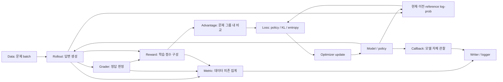

이 문서는 Parse-Focusing의 실제 구현에서 확인한 구분 기준과, 그 기준을 math_reasoning의 독립 RL·SFT·evaluation에 적용한 설계다. 기존 [구조 계획](architecture_plan.md)을 보완한다. 아래는 설계 원칙과 확장 목표를 함께 설명한다. 구현한 부품과 현재 지원 범위는 [구현된 구조](architecture.md)에 별도로 기록했다.

분리의 판단 순서는 다음과 같다.

1. 무엇을 읽는가: 데이터와 예측인가, 모델 자체인가, 실행 상태인가.
2. 무엇을 하는가: 학습 신호를 만드는가, 결과를 관찰하는가, 실행을 관리하는가.
3. 언제 달라지는가: 입력마다인가, 모델 update마다인가, 실행 환경을 바꿀 때인가.
4. 무엇을 소유하는가: 학습 가능한 parameter, 누적 통계, sampler/RNG, worker 같은 자원 중 무엇인가.
5. 무엇과 독립적으로 바꿀 수 있는가: model, objective, metric, 시각화, backend 중 다른 영역의 코드를 수정할 필요가 있는가.

데이터 의존 여부만으로 모든 부품을 나누지는 않는다. loss와 reward도 데이터를 읽지만 학습 신호를 만든다. metric은 이를 관찰·집계한다. 같은 entropy 함수도 목적함수에 들어가면 loss 항이고, 평가 결과를 요약하면 metric이다.

참조 코드에서 확인한 기준과 대응은 다음과 같다.

| 구분 | 참조 구현에서 확인한 사실 | 이번 프로젝트에 적용할 기준 |
|---|---|---|
| `model` / `modules` | `NeuralPCFG`가 symbol/parameterizer를 구성하고 `RuleParameterizer`는 parent encoder, child encoder, composer, probability를 받는다 | 전체 LM과 재사용하는 adapter/head 등 학습 가능한 부품을 구분한다 |
| `model` / 추론 방식 | `NeuralPCFG.get_grammar()`와 `decode()`가 구분되며 `decode_type`을 전달한다 | 모델 가중치·forward와 sampling/greedy 등 답변 생성 방식을 분리한다 |
| `model` / `loss` | `LightningNPCFG.training_step()`이 먼저 model을 호출하고 결과를 `self.loss(**res)`에 전달한다 | 모델 출력에서 loss를 계산한다. 모델이 실험의 목적함수 가중치나 실행 횟수를 소유하지 않는다 |
| 개별 loss / composition | `LocalGlobalLoss`가 개별 항, weights, reduction을 조합한다 | policy objective, KL, entropy와 reduction을 구분하고 조합한다 |
| `task` / `trainer` | `LightningNPCFG`가 model/loss/metric을 연결하고 `main.py`가 별도 Trainer를 생성한다 | RL/SFT task의 계산 연결과 GPU/분산/저장/재개 실행을 나눈다. RL task에 Lightning을 요구하지 않는다 |
| `metric` / 모델 관찰 callback | `geometry.py`가 rule/embedding을 epoch마다 읽으며 batch별 반복 계산을 피한다 | 예측 정답률·출력 통계와 가중치/adapter geometry를 나눈다 |
| 결과 표현 / metric | `ParsedData`가 정규화된 예측/gold와 파생 정보를 지연 계산해 공유한다 | PredictionData/TrajectoryBatch로 ID, mask, 예측, 채점 결과를 공유하고 metric마다 다시 추론·채점하지 않는다 |
| 계산 / 시각화·저장 | task가 `*_vis_metrics`를 계산·cache하고 callback이 결과를 사용한다 | 수치·곡선·confusion matrix 계산과 그 결과의 표/그림/파일 저장을 분리한다 |
| 전처리 / DataModule / sampler | 변환 함수, 데이터 준비·loader 구성, batch 순서·RNG 상태가 별도 역할이다 | 원본 문제/label 변환, task별 입력 view, 문제 sampling, 답변 sampling을 나눈다 |
| 순수 계산 / runtime | `metric/functional` 함수를 callback과 offline 분석에서도 사용한다 | norm/entropy/pass@k 등의 계산이 logger·Trainer·W&B를 import하지 않게 한다 |
| 실험 recipe / 부품 config | `experiment` defaults가 부품을 선택하고 config test가 task 아래 중복 설정을 검사한다 | 한 설정의 값은 한 군데서 정의한다. task가 model/loss/optimizer 복사본을 보관하지 않는다 |
| 모델 seed / 데이터 seed | `test_rng_isolation.py`가 모델 초기화와 batch 순서의 독립성을 실제 loader에서 검사한다 | model/data/rollout/eval/관찰 RNG를 분리하고 관찰 활성화가 학습 표본 순서를 바꾸지 않게 한다 |
| runtime 결과 / 사후 분석 | `analysis/io.py`가 저장된 결과를 공통 loader로 읽는다 | 로그 포맷을 각 분석 스크립트가 재해석하지 않고 공통 artifact reader를 사용한다 |

근거 파일은 [NeuralPCFG](../../Parse-Focusing/scripts/parser/model/NeuralPCFG.py), [RuleParameterizer](../../Parse-Focusing/scripts/parser/modules/parameterizer.py), [LightningNPCFG](../../Parse-Focusing/scripts/parser/lit_model/LightningNeuralPCFG.py), [LocalGlobalLoss](../../Parse-Focusing/scripts/parser/loss/composition.py), [모델 geometry 관찰](../../Parse-Focusing/scripts/parser/callbacks/geometry.py), [ParsedData](../../Parse-Focusing/scripts/parser/metric/parsed_data.py), [DataModule](../../Parse-Focusing/scripts/parser/data/data_module.py), [config 검사](../../Parse-Focusing/tests/test_configs.py), [RNG 검사](../../Parse-Focusing/tests/test_rng_isolation.py), [analysis loader](../../Parse-Focusing/scripts/analysis/io.py)다.

참조의 모든 callback이 모델 관찰만 하는 것은 아니다. prediction writer와 checkpoint 같은 프레임워크 callback도 존재하고, 데이터와 모델 정보가 함께 필요한 metric도 있다. 여기서 모방할 기준은 사용자가 지적한 연구용 관찰 계층의 분리다. 모델 자체 관찰, 데이터 의존 계산, 결과 표시, 실행 관리를 코드에서 식별할 수 있게 만든다.

이 기준을 RL에 적용하면 다음처럼 구분된다.

| 부품 | 읽는 것 → 만드는 것 | 책임에서 제외할 것 |
|---|---|---|
| Data | 원본 문제·split → prompt batch, ID, gold metadata | 답변 생성 수와 reward weight |
| Model | model spec·token → logits/log-prob | grader, GRPO normalization, checkpoint 선택 |
| Rollout | prompt + policy + sampling 설정 → trajectories | 수학 채점, advantage, optimizer update |
| Grader | completion + gold → 판정/추출 상태 | reward 가중치, policy loss, split 전체 점수 |
| Reward | 판정 + 답변 특성 → reward components와 학습용 score | pass@k, GRPO baseline/normalization |
| Advantage | reward + prompt group + response mask → advantage | 모델 로딩, 새 답변 생성, gradient update |
| Loss | 현재/이전/reference log-prob + advantage + mask → 미분 가능한 objective와 항별 값 | advantage 재계산, 데이터 sampling, W&B 기록 |
| Metric | 예측/판정/trajectory 통계 → 데이터 의존 집계 | 학습 신호 변경, 모델 파라미터 수정 |
| Model callback | 모델 parameter snapshot → 구조 관찰값 | 새 평가 답변 생성, reward/advantage 변경 |
| Task | 위 부품의 계약 → 학습 계산 연결 | 개별 수식 복제, 경로 관리 |
| Trainer/backend | task와 config → 분산 실행, gradient 동기화, optimizer step | 새로운 metric마다 알고리즘 변경 |
| Runner | 실행 요청 → worker 시작/종료, 설정 동결, 로그·재개 관리 | 수학 채점과 GRPO 수식 |

흐름과 관찰 위치를 그리면 다음과 같다. 이 그림은 계산 의존성을 표현하며 비동기 verl 작업의 실제 시간 순서를 강제로 직렬화하지 않는다.



같은 종류의 값이라도 사용 목적과 의존성에 따라 위치가 달라진다.

- 정답 여부를 얻는 판정은 grader다. `2 × correctness + 0.5 × format + 0.5 × numeric`은 reward composition이다. 정답 수/문제 수와 pass@k는 metric이다.
- 응답 token에 대한 entropy나 KL, reward 분포, clipping 비율은 입력 trajectory에 의존한다. 모델 자체 callback에 두지 않는다. KL/entropy가 gradient를 만드는 목적함수에 포함되면 loss의 항이다.
- embedding이나 LoRA 유효 가중치의 spectrum은 모델 관찰 callback이다. 입력을 통과시켜 얻는 hidden-state spectrum은 데이터 의존 진단이다.
- 특정 metric의 곡선을 그리는 코드는 수치를 계산하지 않고 이미 계산된 결과를 읽는다. `Metric.compute()`를 그림 하나마다 반복해 reset하지 않는다.
- LoRA module과 target layer 선택은 model 구성이다. LoRA weight 변화 관찰은 callback이고, LoRA parameter penalty를 목적함수에 넣는다면 loss다.
- GRPO에서 한 질문의 답변들을 묶는 group ID는 algorithm 입력이다. 전체 정확률이나 pass@k의 집계 ID와 관련은 있지만 동일한 수식이나 기능은 아니다.

RL에 필요한 코드와 설정은 다음 위치로 분리한다.

```text
config/
├── model/                      # 구조, 초기 가중치, adapter
├── data/                       # 원본, 전처리, prompt, question sampler
├── rollout/                    # 문제당 답변 수와 sampling recipe
├── grader/                     # 수학 판정 구현/버전/worker
├── reward/
│   ├── leaf/                   # correctness, format, numeric
│   └── math.yaml               # 가중 합
├── advantage/                  # grpo와 normalization
├── loss/
│   ├── policy/                 # clipped policy objective
│   ├── regularization/         # KL, entropy
│   ├── reduction/              # token/sequence 집계 의미
│   └── grpo.yaml               # 위 loss 항 조합; advantage와 별도
├── metrics/                    # 결과를 관찰하는 데이터 의존 계산
├── callbacks/                  # 모델 관찰과 관찰 결과 표시
├── optimizer/
├── lr_scheduler/
├── train_config/               # update 수, batch/accumulation
├── test_config/                # 학습과 별도 평가 decoding
└── trainer/                    # 분산 실행과 저장/검증 주기

scripts/reasoning/
├── model/                      # model/module 조립, 초기화/관찰 인터페이스
├── data/
├── rollout/                    # 생성 인터페이스, sampling spec, TrajectoryBatch
├── reward/                     # component와 composition
├── advantage/                  # estimator spec/계약, native 연결 식별자
├── loss/                       # policy/regularization/reduction 조합 계약
├── metric/
│   └── functional/             # 데이터/모델 관찰과 분석의 순수 계산
├── callbacks/                  # 모델 관찰 구현
└── lit_model/                  # SFT task만 Lightning 사용

scripts/train/rl/
├── runner.py                   # 프로세스와 run 관리
├── worker.py                   # verl 환경의 실행 진입점
├── task.py                     # RL recipe와 각 계산 계약 연결
├── config.py                   # 공통 설정을 native config로 변환
├── backend.py                  # native 역할/registry/worker 연결
├── observation.py              # 분산 actor에서 모델 관찰값 수집
└── checkpoint.py               # native save/resume/export

scripts/eval/
├── pipeline.py                 # 추론 → task별 채점/metric → 저장
├── inference/                  # 공통 생성 인터페이스 연결 또는 분류 forward
├── graders/                    # RL reward와 eval이 공유하는 판정 서비스
├── scope.py
└── artifacts.py
```

`scripts/eval/graders`는 독립적으로 import 가능한 서비스이며 eval 실행을 시작하지 않는다. RL reward에는 이 서비스를 주입한다. 생성 인터페이스는 `reasoning/rollout`에서 공유하되, RL adapter가 생성한 trajectory의 학습용 metadata를 독립 eval에 강제로 요구하지 않는다. 분류 eval은 모델 forward를 사용하며 RL rollout 형식으로 바꾸지 않는다.

학습되는 actor, rollout에 사용한 policy, 이전 log-prob의 policy, KL reference는 역할이다. 이 역할을 각각 다른 모델 아키텍처처럼 model 폴더에 복제하지 않는다. 공통 ModelSpec을 backend가 역할과 worker에 연결하고 각 snapshot/version을 기록한다. SFT 여부와 무관하게 지정한 초기 모델을 이 경로로 받는다.

실제 verl 연결 근거는 [ray_trainer.py](../ext/verl/verl/trainer/ppo/ray_trainer.py), [core_algos.py](../ext/verl/verl/trainer/ppo/core_algos.py), [workers/utils/losses.py](../ext/verl/verl/workers/utils/losses.py)다. 이미 존재하는 계산 경계를 사용한다.

| 프로젝트 부품 | 현재 native 연결 | 초기 이전 범위 |
|---|---|---|
| model | `actor_rollout_ref.model` | 초기 모델/adapter 설정 변환, 유효 가중치 검증 |
| rollout | `actor_rollout_ref.rollout`, `async_rollout_manager.generate_sequences` | 생성 spec 변환과 trajectory 식별자 보존 |
| grader/reward | `reward.custom_reward_function` | 현재 compute_score의 판정 호출·개별 점수·가중 합을 실제 함수/모듈로 추출 |
| advantage | `algorithm.adv_estimator`, `compute_advantage`, `compute_grpo_outcome_advantage` | GRPO group/mask/normalization 설정 연결 |
| policy objective | `actor.policy_loss.loss_mode`, `get_policy_loss_fn` | native loss 선택과 clipping 설정 연결 |
| KL/entropy/reduction | actor의 coefficient/flag/`loss_agg_mode`, `ppo_loss` | 개별 항을 조립한 설정을 native 계산에 연결 |
| metric | native 결과/rollout·validation 기록 | 표준 prediction/trajectory로 변환 후 공통 계산 |
| model callback | 분산 actor parameter/모델 상태 | 필요한 관찰만 worker에서 수집하는 연결 구현 필요 |

설정 파일을 나눠놓고 임의의 `_target_`가 verl 학습 안에서 실행될 것처럼 취급하지 않는다. 실제 hook/registry 또는 명시적인 config mapping이 있어야 지원하는 부품이다. 현재 GRPO는 trainer의 명시적 분기를 통해 호출되므로 estimator registry만 바꾸어 모든 계산이 대체된다고 가정하지 않는다.

초기에는 기존 GRPO 실행과 동등한 native 조합을 연결한다. 새 advantage나 policy objective는 native 확장 지점과 필요한 입력을 검증해 추가한다. 이미 있는 분산 학습·loss 코드를 복제해 별도 GRPO 구현을 만들지 않는다. 프로젝트 소유 코드의 실제 함수 추출, 표준 입출력, config mapping과 extension point를 함께 제공한다.

분리 시 반드시 보존할 의미는 다음과 같다.

- GRPO group: 동일한 질문에서 생성한 답변의 ID, repeat 순서, mask와 reward 위치를 유지한다. 같은 group의 표본이 완성되기 전에 그룹 통계를 확정하지 않는다.
- Probability: 생성 policy의 log-prob, 업데이트 기준 old log-prob, 현재 log-prob, reference log-prob를 구분한다. temperature와 tokenizer 적용 조건도 함께 기록한다.
- Loss reduction: token mean과 sequence mean, DP/accumulation의 정규화는 단순 폴더 이동으로 달라지지 않아야 한다. 개별 항 가중치와 KL 적용 위치도 보존한다.
- Gradient: grader/reward/advantage는 기존 GRPO의 학습 target 경계를 유지하며, actor의 현재 log-prob에는 loss gradient가 흐른다. metric/관찰용 payload는 detach한다.
- Runtime: 계산 연결을 나눈다는 이유로 GPU tensor를 매 단계 CPU에 복사하거나 actor update와 rollout weight sync 순서를 바꾸지 않는다. 통계·artifact 변환은 분산 실행 경계에서 수행한다.
- Cost: 필요한 metric/callback이 요구할 때만 비싼 entropy/log-prob/parameter 수집을 켠다. 지원 불가능한 요구는 조용히 생략하지 않는다.

완료 검증도 책임 경계에 대응시킨다.

1. grader fixture와 reward weight를 바꿔도 correctness metric의 정의가 유지되는지 확인한다.
2. 고정 reward/group/mask에서 native와 같은 advantage가 나오는지 확인한다. 새로운 방식을 추가할 때는 해당 estimator의 의미를 검증한다.
3. 고정 logits/log-prob/advantage/mask에서 기존 native loss 값과 gradient가 유지되는지, reduction/항별 coefficient가 정확히 연결되는지 확인한다.
4. metric만 교체했을 때 생성·학습 설정이 바뀌지 않고, 모델 관찰 callback이 데이터 loader 없이 동작하는지 확인한다.
5. 시각화 on/off가 metric compute/reset 횟수와 값에 영향을 주지 않는지 확인한다.
6. 모든 recipe의 compose뿐 아니라 configured target의 import/instantiate와 backend mapping도 검사한다. task 아래에 복사된 model/loss 설정이 override를 가리지 않아야 한다.
7. 일반 모델과 SFT 모델에서 각각 RL을 시작하고, 풀이 SFT·오류 분류 SFT와 독립 eval이 공통 model/metric/관찰 부품을 사용하는지 확인한다.

현재 변경은 분리 기준과 구체적인 RL 연결 계획이다. Python 실행 코드와 native verl을 이전하거나 GPU 학습을 실행한 결과로 제시하지 않는다.
